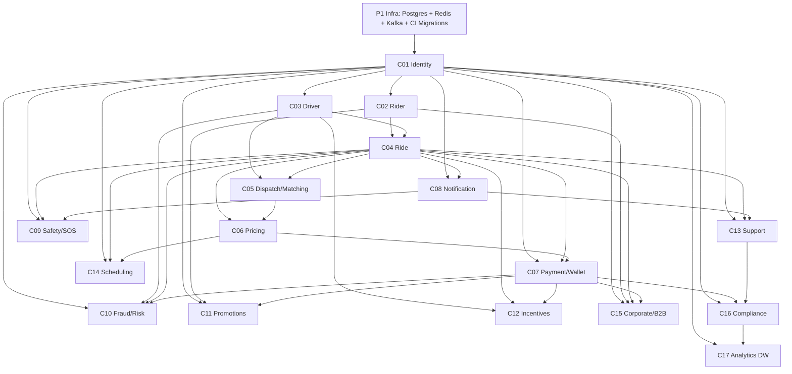

# Ride Match System - Execution Tracker (As-Is -> To-Be)

## 1) Program Baseline
- Current state: modular monolith (`goapp-server`) with mock-first runtime paths.
- Target state: microservices with PostgreSQL (248 tables), Redis, Kafka, and independent deployability.
- Delivery horizon: 18 weeks, 5 phases.

## 2) Phase-Wise Deliverables

| Phase | Weeks | Goal | Deliverables | Exit Criteria |
|---|---:|---|---|---|
| Phase 1: DB Foundation | 1-2 | Make persistence layer production-capable | Provision Postgres/Redis/Kafka (dev+staging), apply all SQL migrations, migration runner in CI, schema versioning, backup/restore test | All migrations green in CI, rollback tested, schema drift check enabled |
| Phase 2: Core Services | 3-6 | Cut critical runtime paths first | Identity, Rider, Driver, Ride, Dispatch/Matching services extracted with APIs/events, auth/session flow moved off in-memory | Core rider journey runs without monolith in critical path |
| Phase 3: Supporting Services | 7-10 | Add operationally required business systems | Pricing, Payment/Wallet, Notification, Safety/SOS, Fraud/Risk, Saga orchestration | Payment + trip completion + incident flows stable in staging |
| Phase 4: Enhancements | 11-14 | Improve growth/retention features | Promotions/Referrals, Driver Incentives, Support/Ticketing, recovery hardening, observability SLO dashboards | Feature parity for enhancement scope, SLO alerting active |
| Phase 5: Enterprise Features | 15-18 | Complete enterprise footprint | Scheduling, Corporate/B2B, Compliance/Audit, Analytics warehouse feeds, cost/perf tuning | Production readiness sign-off, DR drill passed, launch checklist complete |

## 3) Service Cut Tracker

| Cut ID | Service | Phase | Depends On | Status |
|---|---|---|---|---|
| C01 | Identity Service | 2 | P1 infra | Not Started |
| C02 | Rider Service | 2 | C01 | Not Started |
| C03 | Driver Service | 2 | C01 | Not Started |
| C04 | Ride Service | 2 | C02, C03 | Not Started |
| C05 | Dispatch/Matching Service | 2 | C03, C04, Redis | Not Started |
| C06 | Pricing Service | 3 | C04, C05 | Not Started |
| C07 | Payment/Wallet Service | 3 | C01, C04, C06 | Not Started |
| C08 | Notification Service | 3 | C01, C04 | Not Started |
| C09 | Safety/SOS Service | 3 | C01, C04, C08 | Not Started |
| C10 | Fraud/Risk Service | 3 | C01, C03, C04, C07 | Not Started |
| C11 | Promotions/Referrals Service | 4 | C01, C02, C07 | Not Started |
| C12 | Driver Incentives Service | 4 | C03, C04, C07 | Not Started |
| C13 | Support/Ticket Service | 4 | C01, C04, C08 | Not Started |
| C14 | Scheduling Service | 5 | C01, C04, C06 | Not Started |
| C15 | Corporate/B2B Service | 5 | C01, C02, C04, C07 | Not Started |
| C16 | Compliance Service | 5 | C01, C07, C13 | Not Started |
| C17 | Analytics/Warehouse Pipelines | 5 | Kafka topics from C01-C16 | Not Started |

## 4) Dependency Graph

## 5) Definition of Done (Per Service Cut)

Apply to every cut (C01-C17):
- API contract finalized and versioned (OpenAPI/AsyncAPI).
- Own schema/tables migrated and backward-compatible migration verified.
- Own Kafka events produced/consumed with schema versioning + idempotency.
- Redis/cache strategy implemented with TTL and invalidation policy documented.
- AuthN/AuthZ enforced at service boundary.
- P95 latency and error budget baseline measured in staging.
- Structured logs, traces, metrics, dashboards, and alerts live.
- Integration tests + contract tests green in CI.
- Rollback plan proven (deploy rollback + data compatibility).
- Monolith path for that capability disabled behind feature flag after soak.

## 6) Service-Specific DoD Add-ons

### C01 Identity
- OTP request/verify, session issue/validate, and revocation are DB-backed.
- Rate limiting and abuse controls active.
- Session TTL and token rotation validated.

### C04 Ride
- Full ride state machine persisted with legal transitions enforced.
- Idempotency key behavior validated under retries.
- Active-ride recovery works after process restart.

### C05 Dispatch/Matching
- Multi-stage matching uses persistent attempt logs.
- Locking semantics verified with concurrent acceptance simulation.
- No double-assignment under race tests.

### C07 Payment/Wallet
- Ledger-style transaction integrity enforced (no negative drift).
- Webhook verification and replay protection validated.
- Reconciliation report generated daily.

### C09 Safety/SOS
- SOS create/update/resolve path audited with immutable timeline.
- Escalation notification SLA monitoring active.

### C10 Fraud/Risk
- Rule engine decisions traceable with reason codes.
- False-positive review workflow available.

### C17 Analytics
- CDC/event ingestion completeness checks >= 99.9%.
- Core business marts validated (rides, payments, cancellations, demand).

## 7) Weekly Control Plan

- Monday: dependency unblock + sprint planning against cut IDs.
- Wednesday: integration checkpoint (cross-service contract tests).
- Friday: release readiness review (SLO, incidents, rollback readiness).
- End of each phase: formal Go/No-Go with exit criteria evidence.

## 8) Execution Metrics

Track weekly:
- Cut completion: `completed_cuts / planned_cuts`.
- Contract stability: `% passing consumer-driven contract tests`.
- Migration safety: `% reversible migrations`.
- Reliability: P95 latency, error rate, MTTR by service.
- Change safety: failed deployment rate, rollback rate.

## 9) Immediate Next Actions (Week 1)

1. Freeze service boundaries and event ownership map for C01-C05.
2. Stand up dev/stage infra and run all migration scripts end-to-end.
3. Add CI gates: migration check, contract test job, smoke test job.
4. Create feature flags for each cut to allow controlled traffic migration.
